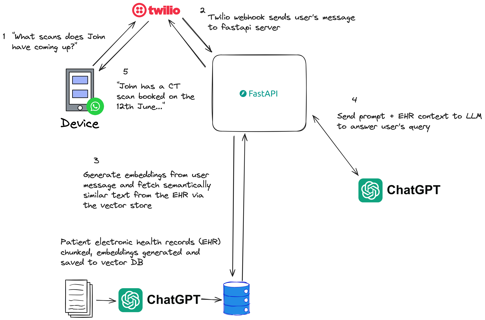

# Ask Florence

Ask Florence, named after [Florence Nightingale](https://en.wikipedia.org/wiki/Florence_Nightingale), is a GenAI application that allows family members to query about their patients in care, alleviating the burden on doctors and medical staff. This app was built as part of the Imperial GenAI x Healthcare hackathon.

I'm proud to have worked on this project with my friends [Jannic](https://github.com/jmholzer) and [Moneim](https://www.linkedin.com/in/moniem-abdu/).

## The Problem

Doctors spend a large amount of time taking calls from family members of admitted patients, providing updates, answering questions and relieving concerns. This activity in and of itself doesn't improve the care of the admitted patient, yet doctors feel a moral obligation to perform it.

## The Solution

Ask Florence is a GenAI, WhatsApp-based chatbot that uses retrieval augmented generation (RAG) to allow family members to directly ask questions about their admitted patients. It works by ingesting patients' electronic health record (EHR) documents into a vector database and then injecting relevant chunks into the context sent to the LLM based on the user's original query. The diagram below shows the flow of information during a request.

## Demo

https://github.com/Omar-V2/async-doc/assets/41272547/b900a20b-ddbb-4c23-9b1d-e6870cecd54b
